### Week 1 Objectives:
* Set up a professional internship environment for the First Cloud Journey program.
* Deeply understand AWS global infrastructure.
* Master the fundamentals of Cloud networking (VPC) and compute services (EC2).

### Detailed Work Log (Week 1):
| Day | Task | Start Date | End Date | Resource |
| :--- | :--- | :--- | :--- | :--- |
| 17/04 | Orientation, account setup & IAM User | 17/04/2026 | 17/04/2026 | [AWS Getting Started](https://cloudjourney.awsstudygroup.com/) |
| 18/04 | Research global infrastructure & service grouping | 18/04/2026 | 18/04/2026 | [Explore AWS Services](https://cloudjourney.awsstudygroup.com/) |
| 19/04 | Study Networking: VPC, Subnet, IGW, Route Tables | 19/04/2026 | 19/04/2026 | [Networking Essentials](https://cloudjourney.awsstudygroup.com/) |
| 20/04 | Install AWS CLI v2 and configure authentication | 20/04/2026 | 20/04/2026 | [AWS CLI Operations](https://cloudjourney.awsstudygroup.com/) |
| 21/04 | Research EC2 architecture, AMI, and EBS lifecycle | 21/04/2026 | 21/04/2026 | [Compute Essentials](https://cloudjourney.awsstudygroup.com/) |
| 22/04 | Lab: Deploy EC2, configure Security Group | 22/04/2026 | 22/04/2026 | [EC2 Workshop](https://cloudjourney.awsstudygroup.com/) |
| 23/04 | Weekly summary and update to Hugo | 23/04/2026 | 23/04/2026 | Self-study |

---

### Practical Evidence:

### 1. Security & Governance (IAM)

**Objective:**
Establish a secure governance framework, implementing the "Least Privilege" principle to isolate operational risks.

**Service Explanation:**

AWS IAM (Identity and Access Management): A service that manages identities and permissions. It allows you to control who (User) can access which resources (Service) and what actions they can perform (Action).

IAM Policy: JSON-formatted files containing rules (Allow/Deny) applied to resources. Using a Customer Managed Policy instead of `AdministratorAccess` ensures the account only has the permissions necessary for the job.

**Execution Steps:**
1. **Create User:** Created an IAM User (`MinhKhanh-DevOps`) instead of using the Root account.
2. **Design Policy:** Instead of using `AdministratorAccess` (full permissions), I proactively created a **Customer Managed Policy** named `MinhKhanh-EC2-Limited-Access`.
3. **Configure Permissions (JSON):** I used JSON syntax to grant granular permissions (`Describe`, `Start`, `Stop`, `CreateKeyPair`) on EC2.
4. **Verification:** When I attempted to create a new Key Pair, the system blocked it with an `Access Denied` error (because `CreateKeyPair` permission had not been granted). Afterward, I edited the Policy to grant the permission and succeeded.

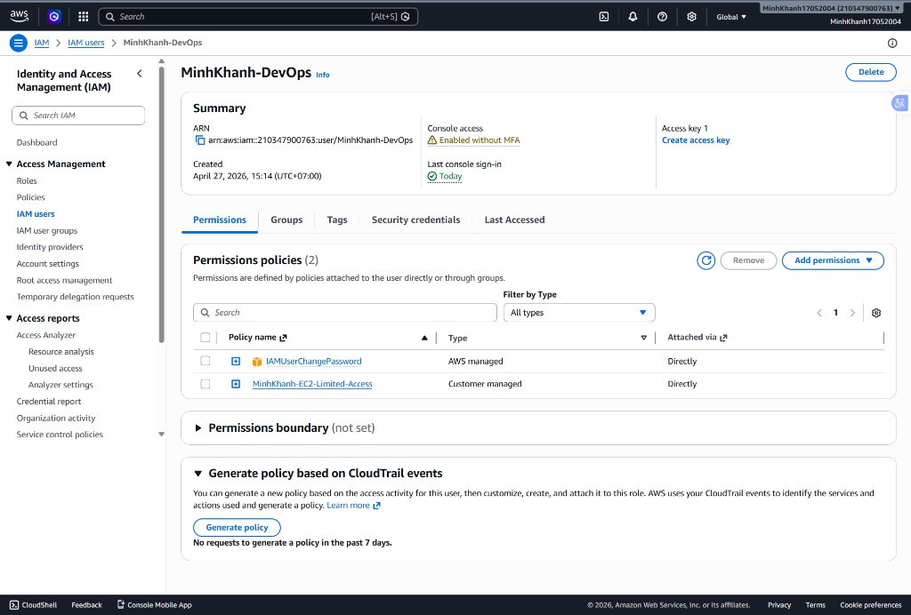 
*Explanation: Overview of the successfully created `MinhKhanh-DevOps` user with permissions restricted via Policy.*

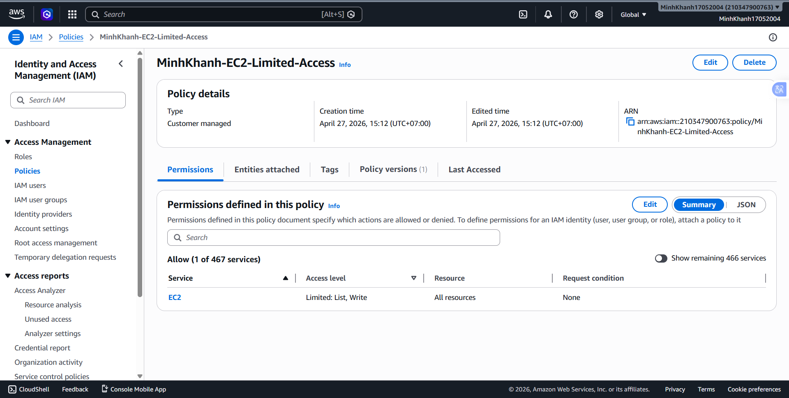
*Explanation: Details of the `MinhKhanh-EC2-Limited-Access` policy, defining only listing and EC2 management actions.*

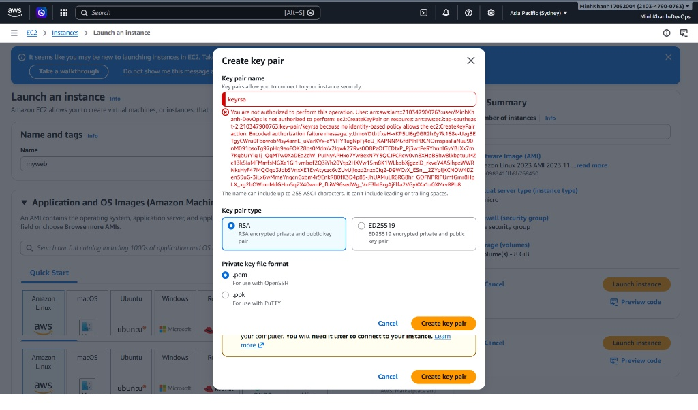
*Explanation: A "Security Badge" – Error message from AWS when the User lacked `ec2:CreateKeyPair` permission, proving the security principle is working effectively.*

### 2. Billing & Cost Management:**

**Objective:**

Manage project finances, set up alerts, and monitor actual costs against the granted credit limit.

**Service Explanation:**

AWS Billing & Cost Management: A cost management tool that allows real-time monitoring of resource consumption, helping administrators grasp incurred costs before exceeding the budget.

* **Steps:** Access Billing Dashboard -> Confirm credit limit ($200.00).

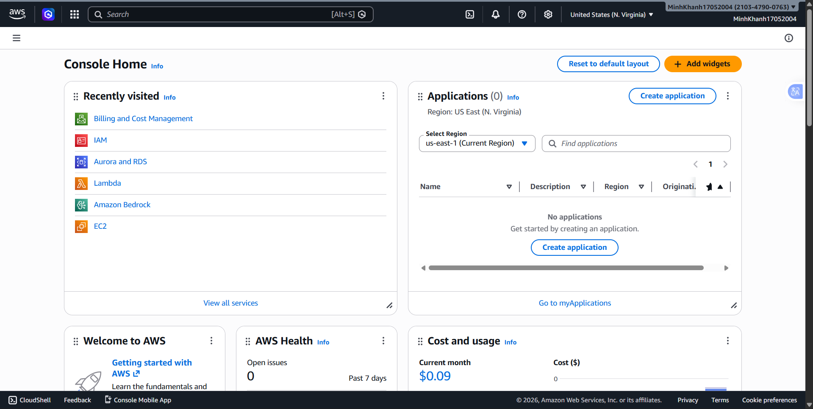 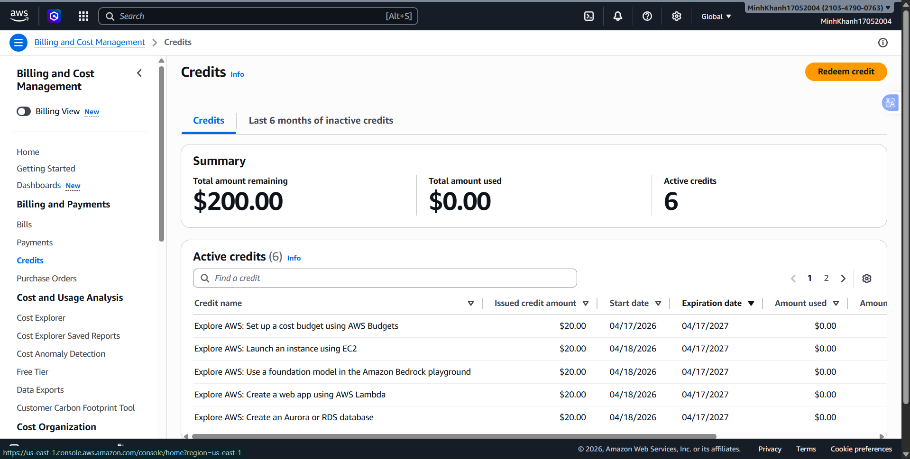

### 3. Networking Infrastructure (VPC - Virtual Private Cloud):**

**Objective:**

Build an "Isolated Network" environment, segmenting infrastructure to secure connections and control data flow.

**Service Explanation:**

Amazon VPC (Virtual Private Cloud): Provides an isolated network space within AWS infrastructure. VPC allows you to define your own IP address range (CIDR block), create subnets, and control routing.

Internet Gateway: A gateway that allows resources in the VPC to communicate with the outside Internet.

* **Steps:** Use Resource Map to analyze VPC, Subnets, and Internet Gateway.
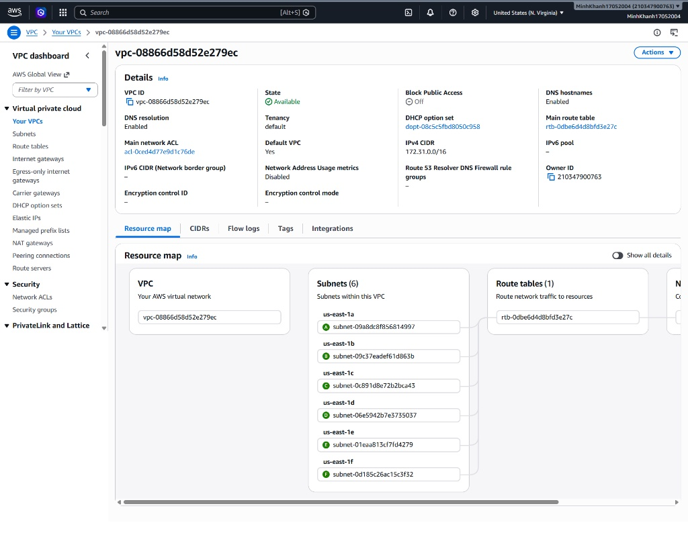

### 4. Routing & Network Segmentation (Routing & CIDR):**

**Objective:**

Set up Route Tables to direct packet traffic between subnets, ensuring the network structure operates logically and securely.

**Service Explanation:**

Route Table: Contains rules (Routes) that determine the direction of network traffic from a Subnet to Gateways or other destination IP addresses.

CIDR (Classless Inter-Domain Routing): A method for partitioning IP address space, used to define the scale and scope of each Subnet in your network system.

* **Steps:** Inspect Route Table -> Verify Subnet CIDR.
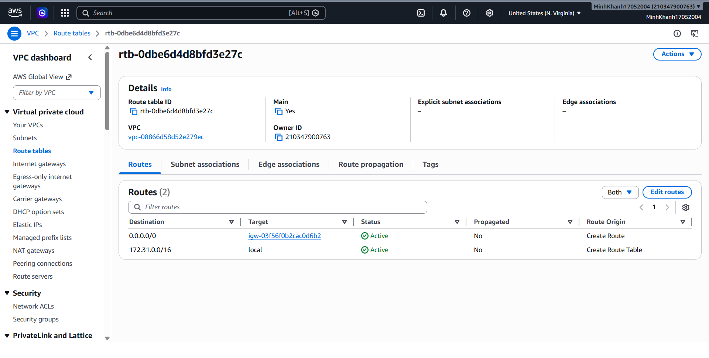 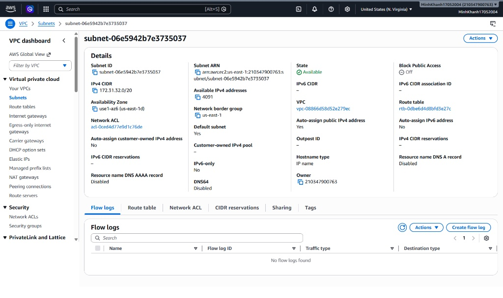

### 5. Automation with AWS CLI & Terraform (IaC):**

**Objective:**

Transition the management model from manual operations (Click-ops) to automation (IaC - Infrastructure as Code) to increase consistency and version control capabilities.

**Service & Tool Explanation:**

AWS CLI (Command Line Interface): A command-line toolset that allows direct interaction with AWS APIs, enabling quick administrative commands that can be embedded into automation scripts.

Terraform (IaC): An open-source tool that allows you to define infrastructure as code. Instead of manual configuration, you write configuration files (`main.tf`), and Terraform uses them to create, update, or delete resources accurately.

AWS Provider: A plugin that helps Terraform understand how to communicate with and control specific AWS resources via API.

**Execution Steps:**
1. **Install Tools:**
   * **AWS CLI v2:** [Download here](https://aws.amazon.com/cli/).
   * **Terraform:** [Download AMD64 version here](https://www.terraform.io/downloads.html).
2. **Configure Authentication:** Run `aws configure` to set Access Key and Secret Key. Authenticate via `aws sts get-caller-identity`.
3. **Initialize Infrastructure (IaC):** * Create a project directory and a `main.tf` file defining the Provider (AWS).
   * Run `terraform init` to download necessary tools (plugins).

**Practical Evidence:**
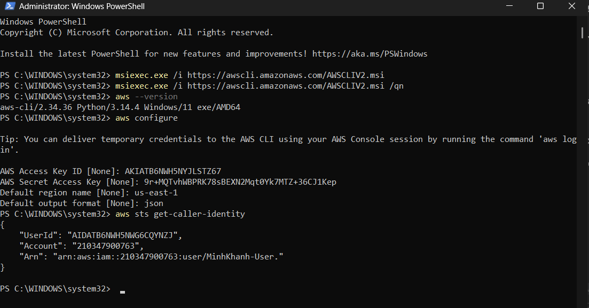
*Explanation: Successful authentication of `MinhKhanh-User` account via AWS CLI.*

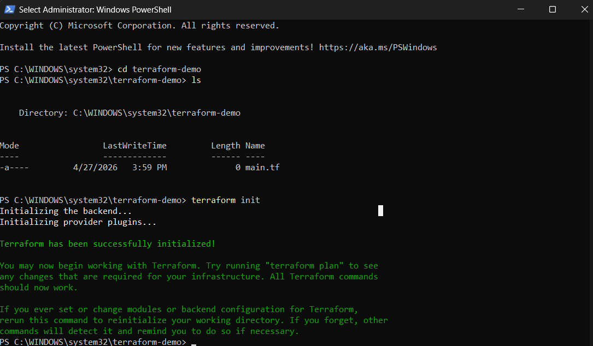
*Explanation: Terraform has been "successfully initialized", ready to build infrastructure.*

### 6. EC2 Virtual Server & Storage (EBS):

**Objective:**
This lab guides you through the process of building a basic network infrastructure on AWS including VPC, Subnet, Internet Gateway, and Route Table. Then, deploy a virtual server (EC2) running Nginx to serve public web content.

**Execution Steps:**

**Step 1: Set up the "Plot of Land" (VPC)**

VPC (Virtual Private Cloud) is your own private network space on AWS.
* **Action:** Access **VPC Dashboard** -> **Your VPCs** -> **Create VPC**.
* **Configuration:**
    * Select "VPC only".
    * Name tag: `MinhKhanh-VPC`.
    * IPv4 CIDR block: `10.0.0.0/16`.
* **Explanation:** The `10.0.0.0/16` CIDR provides a vast internal IP address range (over 65,000 addresses) for resources within your VPC.

**Step 2: Create "Connection Gates" (Internet Gateway & Subnet)**
* **Internet Gateway (IGW):** Select **Internet Gateways** -> **Create internet gateway** -> Name: `MinhKhanh-IGW`. After creation, click **Actions** -> **Attach to VPC** -> select `MinhKhanh-VPC`.
    * *Explanation:* The IGW acts as a bridge, allowing resources in the VPC to communicate with the outside Internet.
* **Subnet:** Select **Subnets** -> **Create subnet** -> Select `MinhKhanh-VPC`.
    * Name: `MinhKhanh-Subnet`.
    * IPv4 CIDR block: `10.0.1.0/24`.
    * *Explanation:* Subnets divide the VPC into smaller network segments. `/24` provides 256 IP addresses, sufficient for server clusters in a lab environment.
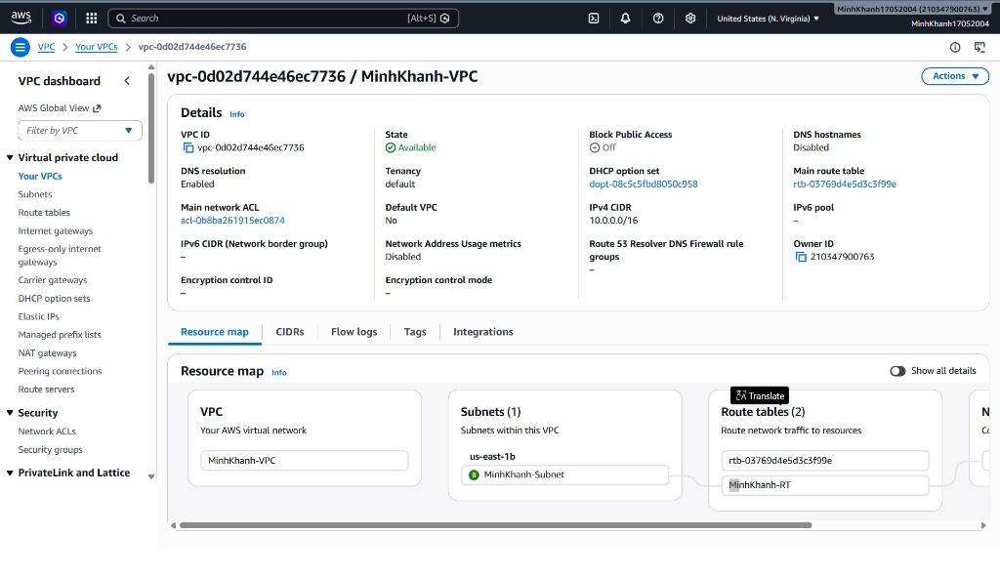
*(Figure 1: Established VPC and Subnet structure)*

**Step 3: Open the road to the Internet (Route Table)**
Without this step, your server will be a "deserted island" unable to connect to the Internet.
* **Create Route Table:** Select **Route tables** -> **Create route table** -> Name: `MinhKhanh-RT` -> Select `MinhKhanh-VPC`.
* **Configure Route:** Select **Routes** tab -> **Edit routes** -> **Add route**:
    * Destination: `0.0.0.0/0`.
    * Target: **Internet Gateway** -> select `MinhKhanh-IGW`.
* **Associate Subnet:** Select **Subnet Associations** tab -> **Edit subnet associations** -> select `MinhKhanh-Subnet` -> **Save**.

**Step 4: Create a "Security Gate" (Security Group)**
A Security Group acts as a virtual firewall controlling inbound/outbound traffic.
* **Action:** Select **Security Groups** -> **Create security group**.
    * Name: `minhkhanh-web-sg`.
    * VPC: `MinhKhanh-VPC`.
* **Inbound rules:** Add a rule for **HTTP** (Port 80) with Source `0.0.0.0/0` (allowing everyone to access the website).
* **Outbound rules:** Leave as default `0.0.0.0/0` so the server can respond to requests or download updates.
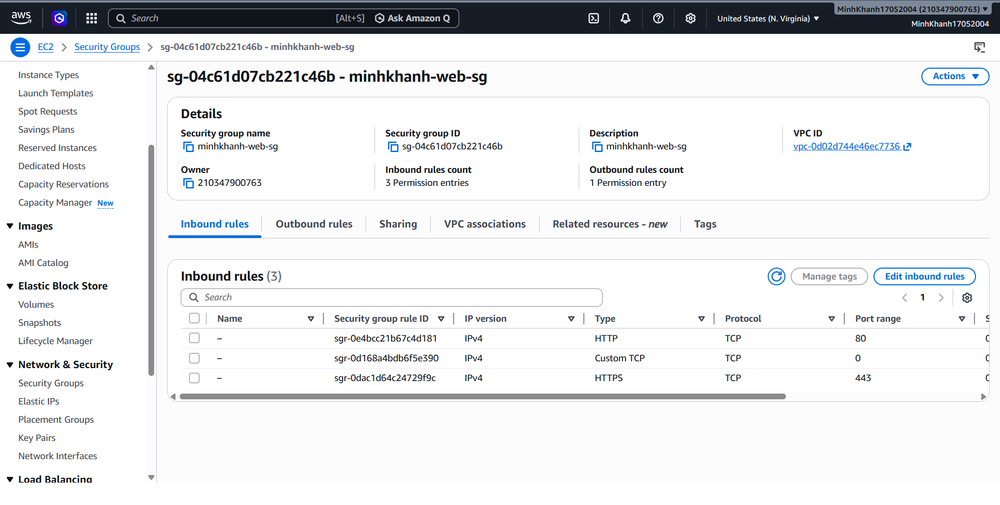
*(Figure 2: Inbound rules configuration for Web Server)*

**Step 5: Initialize Web Server (EC2)**
* **Launch Instance:** Go to EC2 Dashboard -> **Launch instance**.
    * Name: `MinhKhanh-Web-Server`.
    * AMI: **Amazon Linux 2023**.
* **Network settings:** Click Edit:
    * Select `MinhKhanh-VPC`.
    * Select `MinhKhanh-Subnet`.
    * Auto-assign public IP: **Enable** (So the server has a public IP accessible by users).
    * Select Security group: `minhkhanh-web-sg`.
* **User Data:** Automatic installation script in the **Advanced details** section:
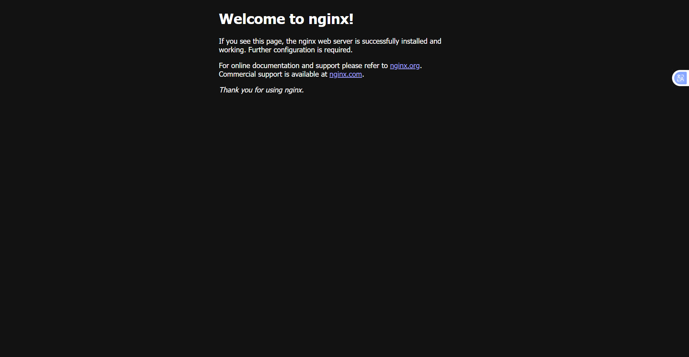
*(Figure 3: Website result running on Nginx)*

### Achievements in Week 1:
* **Management Mindset:** Mastered the principles of Least Privilege (IAM) and Resource Monitoring (Billing).
* **Professional Skills:** Successfully deployed network infrastructure (VPC), compute (EC2), and storage (EBS).
* **Operational Ability:** Proficient in using the CLI to optimize workflows instead of manual operations.