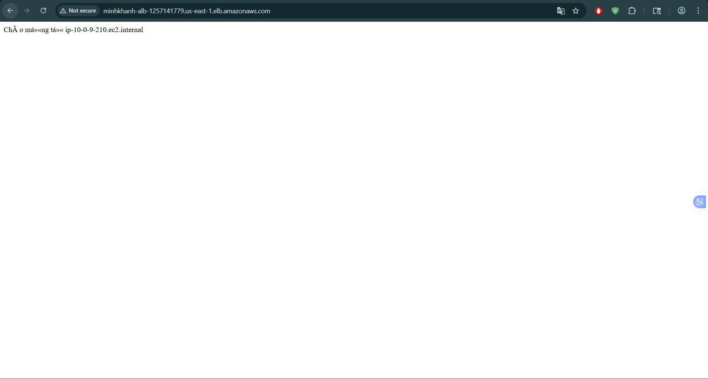
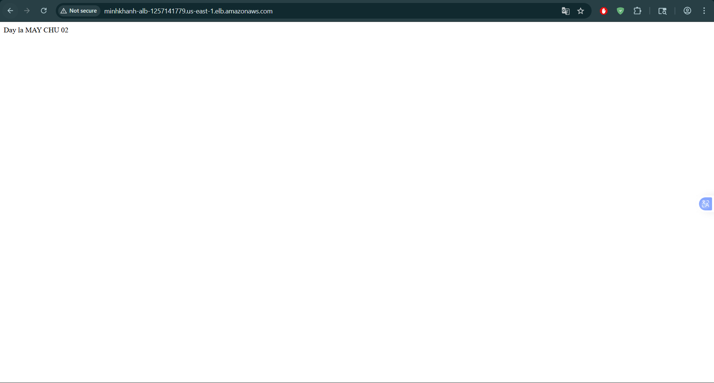
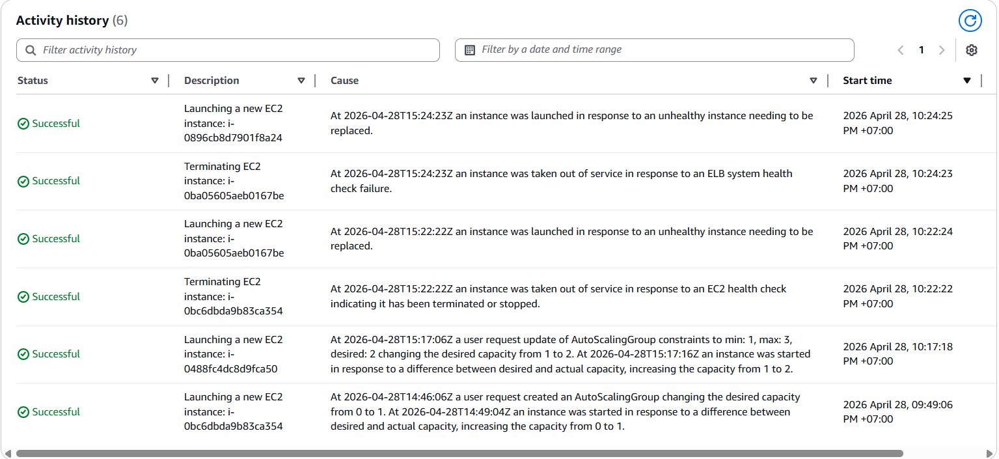
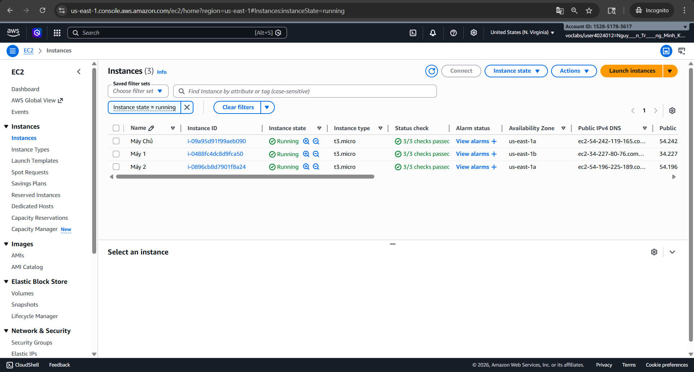

### Mục tiêu Tuần 2:
* Tìm hiểu các dịch vụ lưu trữ (S3) và cơ sở dữ liệu (RDS).
* Nắm vững kiến trúc High Availability (HA) với Load Balancer và Auto Scaling.
* Thực hiện Lab triển khai hệ thống chịu lỗi.

### Nhật ký công việc chi tiết (Tuần 2):
| Thứ | Công việc | Ngày BĐ | Ngày KT | Nguồn tài liệu |
| :--- | :--- | :--- | :--- | :--- |
| 24/04 | Nghiên cứu S3 (Object Storage) & Lifecycle Policy | 24/04/2026 | 24/04/2026 | [AWS Storage](https://cloudjourney.awsstudygroup.com/) |
| 25/04 | Tìm hiểu kiến trúc RDS (Relational Database) | 25/04/2026 | 25/04/2026 | [AWS Database](https://cloudjourney.awsstudygroup.com/) |
| 26/04 | Cấu hình Elastic Load Balancer (ELB) | 26/04/2026 | 26/04/2026 | [Compute Essentials](https://cloudjourney.awsstudygroup.com/) |
| 27/04 | Thiết lập Auto Scaling Group (ASG) | 27/04/2026 | 27/04/2026 | [Compute Essentials](https://cloudjourney.awsstudygroup.com/) |
| 28/04 | Lab: Triển khai Web Server HA | 28/04/2026 | 29/04/2026 | [Workshop Link](https://cloudjourney.awsstudygroup.com/) |
| 30/04 | Tổng kết tuần & Cập nhật Blog | 30/04/2026 | 30/04/2026 | Tự học |

---

### Minh chứng thực tế:

## 1. Lưu trữ đám mây & Quản trị vòng đời dữ liệu (S3 & Lifecycle Policy):

**Mục tiêu:**
Mục tiêu chính là tự động hóa việc quản trị dữ liệu nhằm tối ưu hóa chi phí lưu trữ. Thay vì quản lý thủ công, hệ thống sẽ tự động phân loại và xử lý dữ liệu dựa trên thời gian tồn tại.

**Giải thích dịch vụ:**

Amazon S3 (Simple Storage Service): Dùng để tạo các Bucket làm "kho chứa" dữ liệu an toàn trên đám mây.

S3 Lifecycle Policy (Chính sách vòng đời):

Transition to Standard-IA (sau 30 ngày): Tự động chuyển các file ít dùng sang gói lưu trữ giá rẻ để tiết kiệm tiền.

Expiration (sau 90 ngày): Tự động xóa các file cũ không còn cần thiết để giải phóng không gian và tránh phát sinh chi phí thừa.

* **Các bước chi tiết:**
    1. Vào S3 Console -> **Create bucket** -> Đặt tên, chọn Region -> Bấm **Create**.
    2. Trong Bucket vừa tạo -> chọn tab **Management** -> **Create lifecycle rule**.
    3. Đặt tên Rule -> Chọn "Apply to all objects".
    4. Cấu hình Action: Chọn *Transition to Standard-IA* (sau 30 ngày) và *Expire objects* (sau 90 ngày) -> **Create rule**.
giúp tối ưu chi phí mà không cần thao tác tay.
 

## 2. Triển khai Cơ sở dữ liệu quan hệ (RDS):

**Mục tiêu:**
Mục tiêu chính là thiết lập và kết nối cơ sở dữ liệu quan hệ (Relational Database) trên đám mây. Thay vì tự cài đặt và quản trị Database trên máy ảo EC2, bạn sử dụng dịch vụ quản lý của AWS để đảm bảo tính ổn định, bảo mật và dễ dàng mở rộng.

**Giải thích dịch vụ:**

Amazon RDS (Relational Database Service): Dịch vụ giúp bạn dễ dàng thiết lập, vận hành và mở rộng cơ sở dữ liệu quan hệ trên AWS.

MySQL Engine: Hệ quản trị cơ sở dữ liệu quan hệ (RDBMS) mã nguồn mở phổ biến được chọn để lưu trữ và truy vấn dữ liệu.

Compute Resource (Kết nối EC2): Tính năng tự động cấu hình Security Group để cho phép máy chủ EC2 có quyền truy cập trực tiếp vào cơ sở dữ liệu một cách an toàn.

Free Tier Template: Lựa chọn cấu hình nằm trong gói miễn phí của AWS để bạn thực hành mà không phát sinh chi phí.

* **Các bước chi tiết:**
    1. Vào RDS Console -> **Create database** -> Chọn **Standard create**.
    2. Chọn Engine **MySQL** -> Template **Free tier**.
    3. Nhập *DB identifier*, *Username* và *Password* (cần ghi nhớ kỹ).
    4. Mục **Connectivity**: Chọn EC2 instance của bạn trong phần *Compute resource* để AWS tự động cấu hình bảo mật -> **Create database**.

## 3. Điều hướng lưu lượng & Tính sẵn sàng cao (Load Balancer):
### Mục tiêu
Mục tiêu chính là xây dựng một hạ tầng mạng có tính sẵn sàng cao (High Availability) và khả năng tự phục hồi (Self-healing). Hệ thống sẽ tự động phân phối lưu lượng truy cập và thay thế các máy chủ bị lỗi để đảm bảo dịch vụ không bị gián đoạn.

**Giải thích dịch vụ:**

VPC (Virtual Private Cloud): Tạo ra một môi trường mạng ảo biệt lập với 2 Availability Zones để đảm bảo nếu một vùng gặp sự cố, hệ thống vẫn hoạt động ở vùng còn lại.

Security Group (Tường lửa): Kiểm soát truy cập, chỉ cho phép lưu lượng HTTP (cổng 80) đi vào hệ thống để bảo vệ các máy chủ.

Launch Template: Thiết lập sẵn cấu hình máy chủ (Hệ điều hành, mã nguồn Web) giúp việc khởi tạo các bản sao máy chủ diễn ra nhanh chóng và đồng nhất.

Application Load Balancer (ALB): Đóng vai trò là "người điều phối", nhận yêu cầu từ người dùng và phân chia đều cho các máy chủ con phía sau.

Auto Scaling Group (ASG): Tự động điều chỉnh số lượng máy chủ (tăng lên khi đông người dùng hoặc khởi tạo lại máy mới khi có máy cũ bị lỗi) để duy trì sự ổn định của hệ thống.

---

**Quy trình triển khai**

**Bước 1: Thiết lập "Mảnh đất" (VPC)**
* Truy cập **VPC Dashboard** -> **Create VPC**.
* Chọn **VPC and more**.
* **Name tag:** `MinhKhanh-VPC`.
* **Availability Zones:** 2 (Rất quan trọng cho HA).
* **Public subnets:** 2.
* Nhấn **Create VPC**.

**Bước 2: Thiết lập "Tường lửa" (Security Group)**

Chúng ta sử dụng một `web-sg` chung cho cả Load Balancer và các Web Server.
* **Security Groups** -> **Create security group**.
* **Name:** `web-sg`.
* **VPC:** `MinhKhanh-VPC`.
* **Inbound rules:** HTTP (80) -> Source: `0.0.0.0/0`.

**Bước 3: Tạo Launch Template (Khuôn mẫu máy chủ)**
Đây là "bản gốc" để hệ thống tự động khởi tạo các máy chủ con:
* **EC2** -> **Launch Templates** -> **Create launch template**.
* **Name:** `MinhKhanh-Template`.
* **AMI:** Amazon Linux 2023.
* **Security groups:** `web-sg`.
* **User Data:**

        yum update -y

        yum install -y nginx

        systemctl start nginx

        systemctl enable nginx

        echo "Chào mừng từ $(hostname -f)" > /usr/share/nginx/html/index.html

**Bước 4: Cấu hình Load Balancer (ALB)**

* **EC2** -> **Load Balancers** -> **Create load balancer (ALB).**

* **Name:** `MinhKhanh-ALB.`

* **Network mapping:** Chọn MinhKhanh-VPC và cả 2 Subnet công cộng.

* **Security groups:** Chọn web-sg.

* **Target group:** Tạo MinhKhanh-TG (Target type: Instances).

**Bước 5: Tự động hóa với Auto Scaling (ASG)**

* **Auto Scaling Groups** -> **Create Auto Scaling group.**

* **Launch template**: `MinhKhanh-Template.`

* **Load balancing**: Chọn Attach to an existing load balancer -> Chọn MinhKhanh-TG.

* **Group size**: Desired: 2, Min: 1, Max: 3.
---

**Kết quả điều hướng lưu lượng:**
Hệ thống phản hồi thành công từ các máy chủ khác nhau, chứng minh Load Balancer đã phân phối lưu lượng hiệu quả.

**Lịch sử hoạt động (Activity History):**
Hệ thống tự động phát hiện các instance không đạt tiêu chuẩn (Unhealthy), tiến hành terminate và khởi tạo mới thay thế để duy trì số lượng máy chủ mong muốn.

**Trạng thái hệ thống (Instance Status):**
Hệ thống vận hành ổn định với 3 máy chủ (bao gồm cả máy chủ chính và các máy được ASG quản lý), phân bổ trên các vùng `us-east-1a` và `us-east-1b`.

---

### Kết quả đạt được tuần 2:
* **Storage:** Hiểu rõ cách tối ưu chi phí lưu trữ thông qua tự động hóa (Lifecycle Policy).
* **High Availability:** Triển khai thành công kiến trúc chịu lỗi, đảm bảo dịch vụ luôn thông suốt.