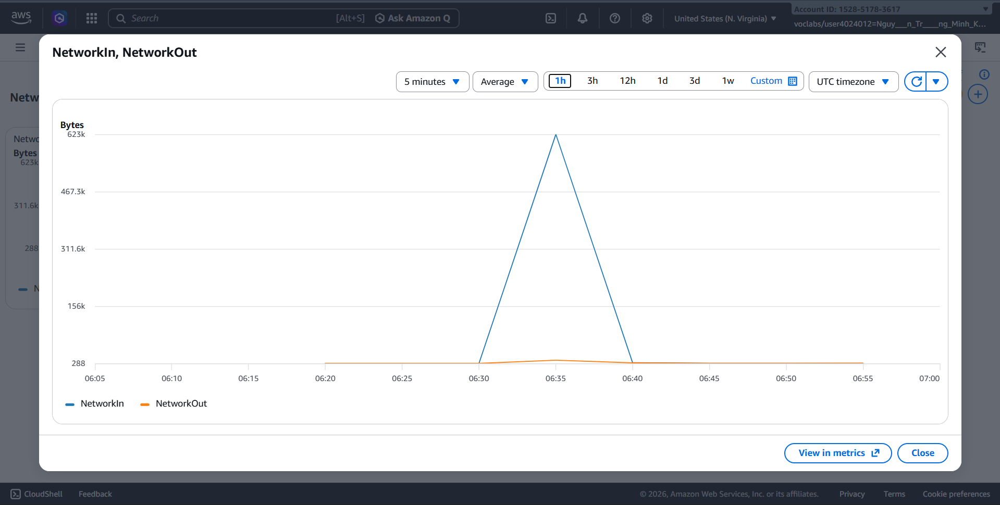
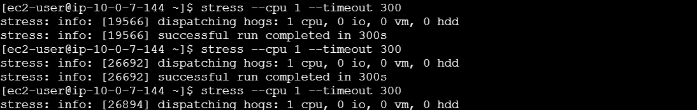
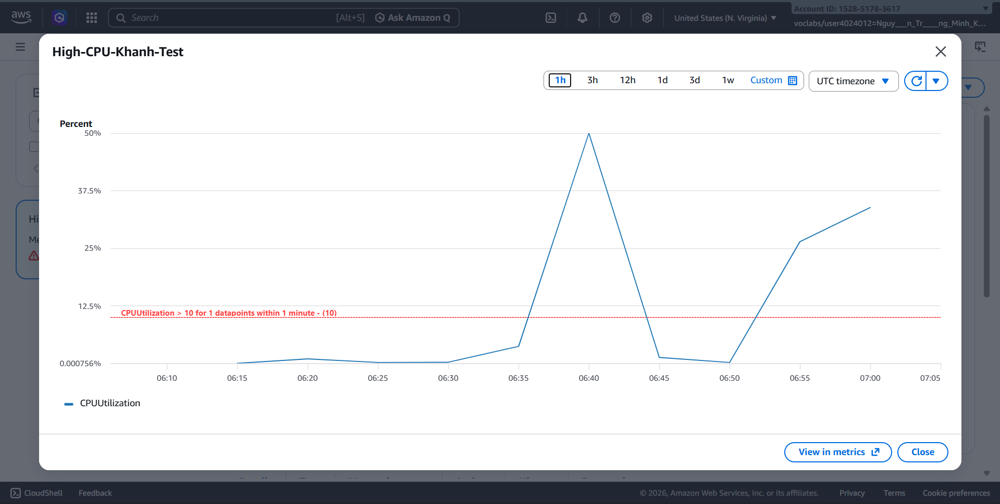
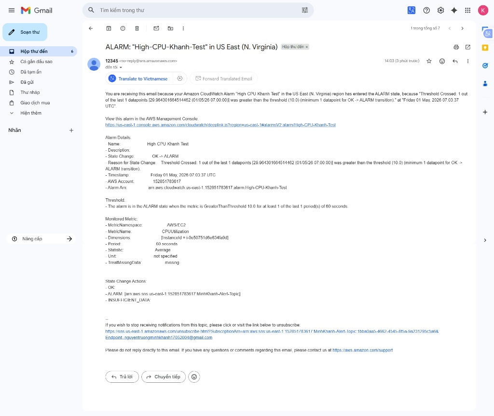
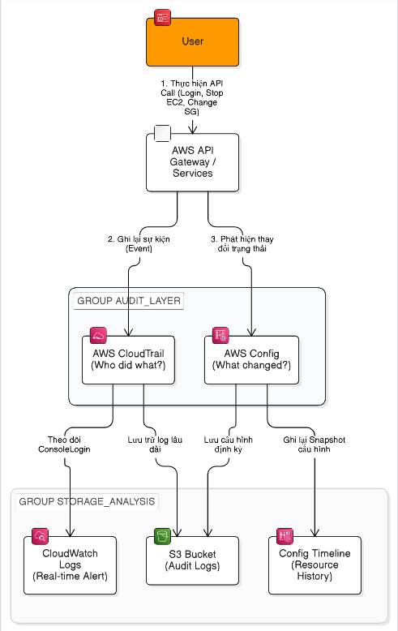
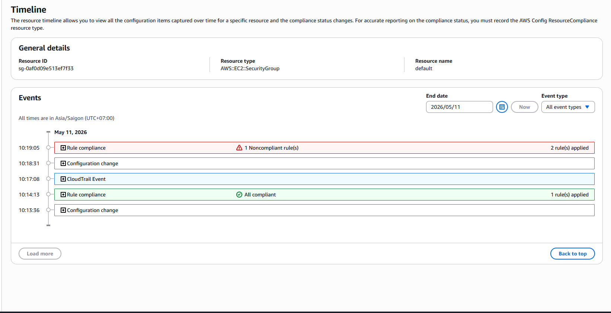
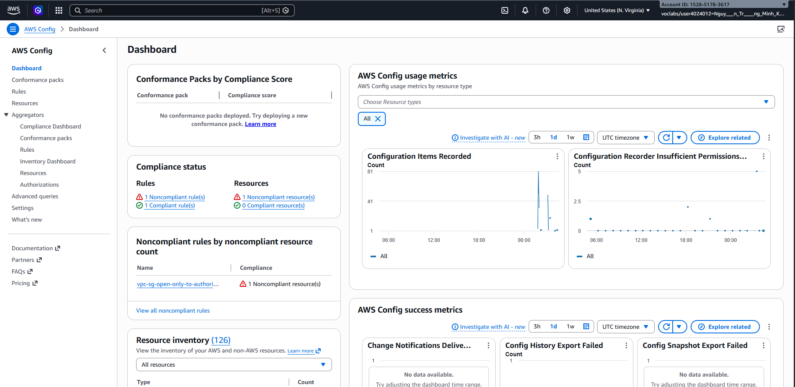
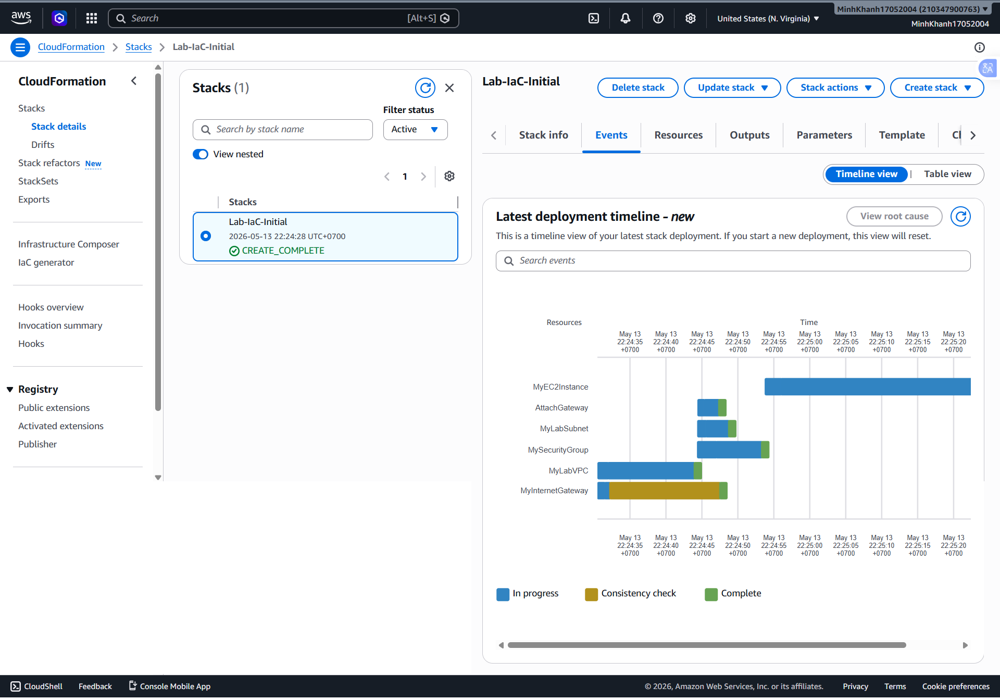

## Week 3 Objectives:
* **Deep Monitoring:** Explore AWS CloudWatch services (Metrics, Logs, Alarms) to monitor system health.
* **Performance Optimization:** Perform Stress Testing to validate the responsiveness of the Auto Scaling Group.
* **Governance & Compliance:** Deploy AWS CloudTrail and AWS Config to monitor user activity and track configuration changes.
* **Multi-Layer Network Security:** Analyze and distinguish between Network Access Control Lists (NACLs - Stateless) and Security Groups (Stateful).
* **Lab Completion:** Integrate comprehensive Monitoring and Security into a 3-Tier Web architecture model.

## Detailed Work Log (Week 3):

| Day | Task | Start Date | End Date | Documentation Source |
| :--- | :--- | :--- | :--- | :--- |
| **04/05** | CloudWatch Deep Dive: Research Metrics (CPU, Network), Log Groups, and Basic Alarms | 04/05/2026 | 04/05/2026 | [AWS Monitoring](https://aws.amazon.com/cloudwatch/) |
| **05/05** | Stress Test & Auto Scaling: Use `stress-ng` to push CPU > 70% to trigger Alarms and ASG | 05/05/2026 | 05/05/2026 | [AWS Auto Scaling](https://aws.amazon.com/autoscaling/) |
| **06/05** | Governance & Audit: Deploy CloudTrail for User tracking and AWS Config for change monitoring | 06/05/2026 | 06/05/2026 | [AWS Governance](https://aws.amazon.com/cloudtrail/) |
| **07/05** | Infrastructure as Code with CloudFormation | 07/05/2026 | 07/05/2026 | [VPC Security](https://docs.aws.amazon.com/vpc/latest/userguide/VPC_Security.html) |
| **08/05** | Final Lab: Integrate Full Stack Monitoring + Security for a 3-Tier System & Write Blog Post | 08/05/2026 | 08/05/2026 | Self-study |

--- 

### Hands-on Evidence:

### 1. CloudWatch & Monitoring System:

**Objective:**
Establish a secure management framework, enforcing the principle of "Least Privilege" to isolate operational risks.

**Service Explanation:**
 
**Amazon CloudWatch**

Function: A management and monitoring service for system resources.

Metrics: Collects performance data points such as server CPU utilization and Network bandwidth.

Alarms: Acts as a sensor, automatically triggering operational actions when metrics breach defined thresholds (e.g., CPU > 10%).

Dashboards: Aggregates charts onto a single page to provide a comprehensive overview of the overall infrastructure network health.

**Amazon SNS (Simple Notification Service)**

Function: A push notification service.

Lab Role: Acts as a "messenger" to deliver alerts from CloudWatch Alarms directly to your personal email as soon as an incident occurs.

**Amazon EC2 (Elastic Compute Cloud)**

Function: Provides secure virtual servers (Instances) in the cloud.

Lab Role: Serves as the primary target for monitoring practices and CPU stress testing to verify alert sensitivity.

**Stress Tool**

Function: Software utilized to simulate resource overload.

Lab Role: Used to push the server's CPU load higher to validate that CloudWatch and SNS operate properly and trigger email notifications.

**Step 1: Prepare the Monitoring Target (EC2 Instance)**
To generate data (Metrics) for CloudWatch, I launched a live virtual machine:
* **Initialization:** From the EC2 Dashboard, select **Launch instance**.
* **Configuration:** 
    * Name: `Monitoring-Lab-Server`.
    * AMI: Amazon Linux 2023 | Instance type: `t2.micro`.
    * Network: Select your personal VPC/Subnet and enable **Auto-assign public IP**.
* **Result:** The server transitioned to a **Running** state after 2 minutes.

**Step 2: Investigate Metrics (System Performance Identifiers)**
* **Access:** CloudWatch Console -> Metrics -> All metrics -> EC2 -> Per-Instance Metrics.
* **Tracking:** Focused heavily on key metrics: `CPUUtilization`, `NetworkIn`, and `NetworkOut`.
* **Optimization:** Modified the **Period** to **1 Minute** to observe detailed serrated chart trends instead of the 5-minute default setting.

> **Technical Note:** A metric is similar to indicators on a motorcycle dashboard. In AWS, a Metric represents values reflecting the actual health of a resource (e.g., the current percentage of CPU load).

**Step 3: Set up SNS (Simple Notification Service)**
An intermediary communication channel is required to dispatch alerts:
* **Topic:** Created a Standard topic named `MinhKhanh-Alert-Topic`.
* **Subscription:** Registered destination delivery via **Email**.
* **Verification:** Accessed my personal email and clicked **Confirm Subscription**. This is a mandatory anti-spam validation by AWS to confirm agreement to receive system updates.

**Step 4: Configure a CloudWatch Alarm**
Establish an automated rule: *"If CPU > 70%, send a notification alert email"*.
* **Condition:** Select the `CPUUtilization` metric with a **Static > 70** threshold definition.
* **Action:** When the state changes to **In alarm**, the system triggers a notification to the SNS Topic established in Step 3.
* **Identification:** Named the Alarm `High-CPU-Warning-MinhKhanh`.

**Step 5: Build a Network Monitoring Dashboard**
Tailored specifically for Network Engineering requirements:
* **Create Dashboard:** Named `Network-Monitoring-Khanh`.
* **Widget:** Added a **Line** chart widget monitoring `NetworkIn` and `NetworkOut` variables.
* **Value:** This dashboard presents a unified overview of inbound/outbound server traffic bandwidth on a single screen without manually searching through hundreds of metrics.

### 1. Network Traffic Monitoring
I configured live traffic tracking charts on the Dashboard to ensure comprehensive control over system network bandwidth.

*Monitoring network traffic (NetworkIn/NetworkOut) on the CloudWatch Dashboard. The charts display bandwidth fluctuations during instance tasks, helping network engineers manage traffic flow in real time.*

---

### 2. Performance Verification (Stress Testing)
To verify alarm workflow functionality, I utilized the `stress` utility to simulate resource overload conditions.

*Utilizing the stress tool on Amazon Linux 2023 to simulate high CPU utilization. This operation aims to test monitoring system sensitivity and the ability to trigger alerts when resources hit threshold limits.*

---

### 3. Alarm State Trigger (CloudWatch Alarm)
When resource consumption crossed the configured test limit threshold (10%), the monitoring engine immediately registered an anomalous state.

*Configuration of the CloudWatch Alarm "High-CPU-Khanh-Test". When CPUUtilization exceeds the 10% threshold, the system automatically transitions from OK to ALARM state, initiating the notification workflow via SNS.*

---

### 4. Automated Notification System
As soon as the alarm was triggered, a warning notification was delivered directly to the administrator for immediate remediation.

*Push notification delivered directly to the administrator's email via Amazon SNS the moment an incident occurs. This ensures fast response times (High Availability & Reliability) in cloud system operations.*

### 2. Build an Automated Monitoring System for Activity Auditing and Network Resource Governance on AWS:
**System Architecture Model**

This represents the complete operational workflow from the moment a user initiates an action until the logs are analyzed and safely stored.

**Objective**
Build an automated monitoring architecture to trace user actions (**Auditing**) and control network resource compliance (**Governance**) across the AWS platform.

---

**Service Explanation**

**AWS CloudTrail:** 

Logs every infrastructure action (API Call) to discover exactly Who did What on the platform.

**AWS Config:**

Tracks configuration compliance history for assets and flags automated alerts when a security violation occurs.

**Amazon S3:** 

Serves as a secure, centralized bucket storage repository for system log management.

---

## Deployment Steps

**Step 1: Initialize Log Repository Storage on Amazon S3**
All audit trail data requires an isolated and secure storage space.

1. Navigate to the **S3 Console** > **Create bucket**.
2. **Bucket name**: Input a globally unique name (e.g., `audit-log-storage-minhkhanh`).
3. **Block Public Access**: Ensure **Block all public access** is checked to maintain log data privacy.
4. Click **Create bucket**.

**Step 2: Set up the Monitoring System with AWS CloudTrail**
Record all configuration changes and user interactions impacting system resources.

1. Navigate to the **CloudTrail Console** > **Trails** > **Create trail**.
2. **Trail name**: `Main-Audit-Trail`.
3. **Storage location**: Choose *Use existing S3 bucket* and point it to the bucket created in Step 1.
4. **Log file validation**: Select **Enabled** (Ensures logs cannot be tampered with without detection).
5. On the **Choose log events** screen, select **Management events** (To capture administrative actions).
6. Click **Next** > **Create trail**.

**Step 3: Deploy Configuration Tracking via AWS Config**
Monitor the operational compliance state of network resources in real time.

1. Navigate to the **AWS Config Console** > **Settings** > **Get started**.
2. **Resource types to record**: Select *Record specific resource types*.
3. Search and select: `EC2:Instance` and `EC2:SecurityGroup`.
4. **Amazon S3 bucket**: Choose the bucket initialized in Step 1.
5. **IAM Role**: Select *Use an existing AWS Config service-linked role*.
6. Click **Next**.

**Step 4: Establish Compliance Rules**
Define safety baselines and protection policies for your setup.

1. On the **AWS Config** screen > **Rules** > **Add rule**.
2. Search for the rule: `vpc-sg-open-only-to-authorized-ports`.
3. **Configuration**: Set up an alert if any port other than `80` or `443` is left exposed to the public internet.
4. Click **Save**. 

### 1. Resource Change Timeline

This snapshot demonstrates the integration between AWS Config and CloudTrail. At 10:17:08, a CloudTrail logging event occurred, leading directly to a resource configuration modification shortly after.

### 2. Compliance Dashboard Overview

The interface displays a red flag status (Noncompliant) because it detected a Security Group exposing ports outside the approved list, allowing administrators to identify operational risks immediately.

### 3. Infrastructure as Code with CloudFormation
**Lab Objective**
This laboratory focuses on transitioning from manual configuration workflows (ClickOps) to software-defined infrastructure (Infrastructure as Code - IaC):
* **Automation:** Initialize a complete VPC and EC2 compute setup from a single declaration blueprint file.
* **Risk Management:** Explore the automated **Update Stack** and safety **Rollback** capabilities when an error occurs during deployment.
* **DevOps Mindset:** Cultivate automation principles preparing for framework technologies such as Terraform and CDK.

---

**AWS Services Utilized**
Within this lab setup, we define and link the following core services:
1. **AWS CloudFormation:** The foundational provisioning engine that reads template configurations to deploy resources in order.
2. **Amazon VPC (Virtual Private Cloud):** Establishes an isolated virtual network layer protecting compute assets.
3. **Amazon EC2 (Elastic Compute Cloud):** Deploys a virtual computing node running the Amazon Linux 2 operating system.
4. **Systems Manager (SSM) Parameter Store:** Dynamically retrieves the latest verified AWS AMI ID to ensure cross-region deployment flexibility.
5. **Security Groups:** Establishes virtual firewall boundaries governing traffic inputs (Port 22 allocated for SSH).

---

**Deployment Steps**

**Step 1: Write the CloudFormation Template (YAML)**
Utilize the following blueprint definitions to establish your architecture. This configuration is optimized to automatically locate the newest available AMI ID:

    AWSTemplateFormatVersion: '2010-09-09'
    Description: 'Infrastructure as Code Final Lab - Success Version'

    Parameters:
      LatestAmiId:
        Type: 'AWS::SSM::Parameter::Value<AWS::EC2::Image::Id>'
        Default: '/aws/service/ami-amazon-linux-latest/amzn2-ami-hvm-x86_64-gp2'

    Resources:
      # Network Topology Initialization
      MyLabVPC:
        Type: AWS::EC2::VPC
        Properties:
          CidrBlock: 10.0.0.0/16
          EnableDnsSupport: true
          EnableDnsHostnames: true
          Tags:
            - Key: Name
              Value: Lab-IaC-VPC

      # Subnet Boundary Definition
      MyLabSubnet:
        Type: AWS::EC2::Subnet
        Properties:
          VpcId: !Ref MyLabVPC
          CidrBlock: 10.0.1.0/24
          AvailabilityZone: !Select [ 0, !GetAZs '' ]
          Tags:
            - Key: Name
              Value: Lab-IaC-Subnet

      # Security Group Authorizing SSH Inbound Traffic
      MySecurityGroup:
        Type: AWS::EC2::SecurityGroup
        Properties:
          GroupDescription: Allow SSH access from anywhere
          VpcId: !Ref MyLabVPC
          SecurityGroupIngress:
            - IpProtocol: tcp
              FromPort: 22
              ToPort: 22
              CidrIp: 0.0.0.0/0

      # EC2 Virtual Machine Node Initialization
      MyEC2Instance:
        Type: AWS::EC2::Instance
        Properties:
          InstanceType: t2.micro
          ImageId: !Ref LatestAmiId
          SubnetId: !Ref MyLabSubnet
          SecurityGroupIds:
            - !Ref MySecurityGroup
          Tags:
            - Key: Name
              Value: Lab-IaC-EC2-Fixed

### 1. CloudFormation Event Stack Logs

### 2. Verified Active Infrastructure Assets Running from the Template Specifications

## Week 3 Achievements:
Network Security: Successfully implemented a Bastion Host architecture for secure SSH entry into isolated Private subnets.

Automation Operations: Configured infrastructure monitoring that automatically adapts to traffic scale shifts via Scaling Policies.

3-Tier Design Mastery: Completed an enterprise-standard multi-tier production model (Web - App - Database) locked behind high-security boundaries.
